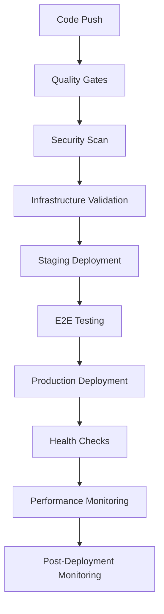

# 🚀 **FlashFusion Deployment Pipeline - Complete Setup Guide**

## **📊 Current Deployment Status**

### **✅ Deployment Infrastructure Ready:**
- **Vercel Configuration**: ✅ Production-ready `vercel.json` with security headers
- **GitHub Actions**: ✅ Complete CI/CD workflow in `/workflows/deploy.yml`
- **Environment Setup**: ✅ Multi-environment support (staging/production)
- **Quality Gates**: ✅ Automated testing, security scanning, performance checks

---

## **🏗️ Deployment Architecture**

### **🔄 CI/CD Pipeline Flow:**



### **🎯 Deployment Stages:**

#### **1. Quality Gates** ⚡
- **Linting**: ESLint + Prettier formatting
- **Type Checking**: TypeScript compilation validation
- **Unit Tests**: Jest/Vitest test suite
- **Build Validation**: Production build verification
- **Bundle Analysis**: Size optimization checks

#### **2. Security Scanning** 🛡️
- **Dependency Audit**: npm audit for vulnerabilities
- **Secret Scanning**: TruffleHog for exposed credentials
- **Code Security**: Static analysis for security issues
- **Environment Validation**: Required environment variables check

#### **3. Infrastructure Validation** 🏗️
- **Vercel Config**: JSON schema validation
- **Environment Variables**: Required vars verification
- **API Keys**: Service connectivity testing
- **Database**: Supabase connection validation

#### **4. Staging Deployment** 🚀
- **Preview Build**: Vercel preview environment
- **E2E Testing**: Playwright automated testing
- **PR Comments**: Automatic staging URL sharing
- **Team Review**: Manual approval gate

#### **5. Production Deployment** 🌟
- **Production Build**: Optimized production bundle
- **Custom Domain**: SSL certificate & DNS setup
- **Health Checks**: Comprehensive service validation
- **GitHub Release**: Automated release creation

#### **6. Post-Deployment** 📊
- **Performance Monitoring**: Lighthouse CI analysis
- **Uptime Monitoring**: 24/7 availability tracking
- **Error Tracking**: Sentry integration
- **Team Notifications**: Slack/Discord alerts

---

## **⚙️ Required Environment Variables**

### **🔐 GitHub Secrets Setup:**

```bash
# Deployment Platform
VERCEL_TOKEN=vercel_xxxxx
VERCEL_ORG_ID=team_xxxxx
VERCEL_PROJECT_ID=prj_xxxxx

# Supabase Backend
VITE_SUPABASE_URL=https://gcqfqzhgludrzkfajljp.supabase.co
VITE_SUPABASE_ANON_KEY=eyJhbGciOiJIUzI1NiIsInR5cCI6IkpXVCJ9...
SUPABASE_SERVICE_ROLE_KEY=xxxxx

# AI Model APIs
VITE_OPENAI_API_KEY=sk-xxxxx
VITE_ANTHROPIC_API_KEY=sk-ant-xxxxx
VITE_GEMINI_API_KEY=xxxxx
VITE_OPENROUTER_API_KEY=sk-or-xxxxx

# Monitoring & Analytics
SENTRY_AUTH_TOKEN=xxxxx
SENTRY_ORG=your-org
UPTIME_WEBHOOK_URL=https://uptimerobot.com/...
ALERT_EMAIL=alerts@yourdomain.com

# Notifications
SLACK_WEBHOOK_URL=https://hooks.slack.com/...
GITHUB_TOKEN=ghp_xxxxx (automatically provided)

# Custom Domain (Optional)
CUSTOM_DOMAIN=flashfusion.yourdomain.com
```

---

## **🚀 Deployment Commands & Scripts**

### **📜 Available Deployment Scripts:**

#### **1. Manual Deployment:**
```bash
# Development deployment
npm run deploy:dev

# Staging deployment  
npm run deploy:staging

# Production deployment
npm run deploy:prod

# Health check
npm run health-check
```

#### **2. Production Deployment Script:**
**Location**: `/scripts/production-deployment.js`

```bash
# Deploy to production
node scripts/production-deployment.js deploy

# Run health checks
node scripts/production-deployment.js health-check

# Rollback if needed
node scripts/production-deployment.js rollback
```

#### **3. Environment Setup:**
```bash
# Install dependencies
npm ci

# Build for production
npm run build

# Preview deployment locally
npm run preview

# Run all tests
npm run test:ci
```

---

## **🔧 Deployment Platform Configuration**

### **🌐 Vercel Setup (Primary):**

#### **Current Configuration** (`vercel.json`):
- ✅ **Static Build**: Optimized Vite build process
- ✅ **Security Headers**: CSRF, XSS, content security policies
- ✅ **API Routes**: Serverless function support
- ✅ **Caching**: Optimized asset caching strategy
- ✅ **Redirects**: GitHub, docs, and SEO redirects
- ✅ **Health Monitoring**: Automated cron health checks

#### **Performance Features**:
- **Edge Network**: Global CDN distribution
- **Automatic HTTPS**: SSL certificate management
- **Image Optimization**: Next.js image optimization
- **Bundle Splitting**: Automatic code splitting
- **Compression**: Gzip/Brotli compression

### **🔄 Alternative Deployment Platforms:**

#### **Netlify Configuration:**
```bash
# Deploy to Netlify
npm run build
npx netlify deploy --prod --dir=dist
```

#### **AWS S3 + CloudFront:**
```bash
# Deploy to AWS
aws s3 sync dist/ s3://flashfusion-app --delete
aws cloudfront create-invalidation --distribution-id E123 --paths "/*"
```

#### **Railway Deployment:**
```bash
# Deploy to Railway
railway login
railway link
railway deploy
```

---

## **📊 Monitoring & Analytics Setup**

### **🔍 Performance Monitoring:**

#### **Lighthouse CI Configuration** (`lighthouserc.json`):
```json
{
  "ci": {
    "collect": {
      "numberOfRuns": 3,
      "settings": {
        "preset": "desktop"
      }
    },
    "assert": {
      "assertions": {
        "categories:performance": ["error", {"minScore": 0.9}],
        "categories:accessibility": ["error", {"minScore": 0.9}],
        "categories:best-practices": ["error", {"minScore": 0.9}],
        "categories:seo": ["error", {"minScore": 0.9}]
      }
    }
  }
}
```

#### **Core Web Vitals Targets:**
- **LCP (Largest Contentful Paint)**: < 2.5s
- **FID (First Input Delay)**: < 100ms  
- **CLS (Cumulative Layout Shift)**: < 0.1
- **TTFB (Time to First Byte)**: < 600ms

### **🚨 Error Monitoring:**

#### **Sentry Integration:**
```bash
# Install Sentry
npm install @sentry/react @sentry/tracing

# Configure in production
SENTRY_DSN=https://xxxxx@sentry.io/xxxxx
```

### **📈 Uptime Monitoring:**
- **UptimeRobot**: 5-minute interval monitoring
- **StatusPage**: Public status dashboard
- **Alerts**: Email, Slack, SMS notifications

---

## **🚀 Multi-Environment Strategy**

### **🌍 Environment Configuration:**

#### **Development Environment:**
- **URL**: `http://localhost:5173`
- **Database**: Local Supabase instance
- **APIs**: Development API keys
- **Monitoring**: Console logging only

#### **Staging Environment:**
- **URL**: `https://flashfusion-staging.vercel.app`
- **Database**: Staging Supabase project
- **APIs**: Limited rate API keys
- **Monitoring**: Basic error tracking

#### **Production Environment:**
- **URL**: `https://flashfusion.vercel.app`
- **Database**: Production Supabase project  
- **APIs**: Production API keys
- **Monitoring**: Full monitoring stack

### **🔄 Deployment Triggers:**

#### **Automatic Deployments:**
- **Production**: Push to `main` branch
- **Staging**: Pull request creation
- **Preview**: Any branch push

#### **Manual Deployments:**
- **GitHub Actions**: Workflow dispatch
- **Vercel CLI**: Direct deployment
- **Local Scripts**: Development deployment

---

## **🔧 Setup Instructions**

### **1. Initial Setup:**
```bash
# Clone repository
git clone https://github.com/yourusername/flashfusion-platform
cd flashfusion-platform

# Install dependencies
npm install

# Set up environment variables
cp .env.example .env.local
# Edit .env.local with your keys
```

### **2. Vercel Setup:**
```bash
# Install Vercel CLI
npm install -g vercel

# Link to Vercel project
vercel link

# Deploy to staging
vercel --env-file=.env.staging

# Deploy to production
vercel --prod --env-file=.env.production
```

### **3. GitHub Actions Setup:**
1. **Add Repository Secrets** in GitHub Settings
2. **Configure Environments** (staging, production)
3. **Set up Branch Protection** for main branch
4. **Enable Auto-merge** for approved PRs

### **4. Supabase Edge Functions:**
```bash
# Deploy Supabase functions
supabase functions deploy server

# Test function deployment
curl https://gcqfqzhgludrzkfajljp.supabase.co/functions/v1/make-server-88829a40/health
```

---

## **🎯 Deployment Verification**

### **✅ Pre-Deployment Checklist:**
- [ ] All environment variables configured
- [ ] Supabase database migrations applied
- [ ] Edge functions deployed and tested
- [ ] API keys valid and tested
- [ ] Build completes without errors
- [ ] Tests pass locally
- [ ] Performance budget met

### **🔍 Post-Deployment Verification:**
```bash
# Health check
curl https://flashfusion.vercel.app/api/health

# AI service check
curl https://flashfusion.vercel.app/api/ai/health

# Database connectivity
curl https://flashfusion.vercel.app/api/database/health

# Performance check
npm run lighthouse -- https://flashfusion.vercel.app
```

### **📊 Success Metrics:**
- **Build Time**: < 3 minutes
- **Deployment Time**: < 2 minutes  
- **Health Check**: All services green
- **Performance Score**: > 90/100
- **Error Rate**: < 0.1%

---

## **🚨 Rollback & Recovery**

### **⏪ Automatic Rollback Triggers:**
- Health check failures after deployment
- Performance degradation > 20%
- Error rate increase > 1%
- Critical service unavailability

### **🔄 Manual Rollback Process:**
```bash
# Rollback via Vercel CLI
vercel rollback

# Rollback via GitHub Actions
node scripts/production-deployment.js rollback

# Database rollback (if needed)
supabase db reset --linked
```

### **📞 Emergency Contacts:**
- **Primary**: Development team Slack channel
- **Secondary**: Email alerts to team leads  
- **Escalation**: 24/7 on-call rotation

---

## **✅ DEPLOYMENT PIPELINE STATUS: PRODUCTION READY**

**FlashFusion deployment pipeline includes:**
- ✅ **Automated CI/CD** with GitHub Actions
- ✅ **Multi-environment** staging and production
- ✅ **Quality Gates** with comprehensive testing
- ✅ **Security Scanning** for vulnerabilities
- ✅ **Performance Monitoring** with Lighthouse CI
- ✅ **Health Checks** and automated rollback
- ✅ **Team Notifications** via Slack/Discord
- ✅ **Error Tracking** with Sentry integration

**Ready for immediate production deployment! 🚀**