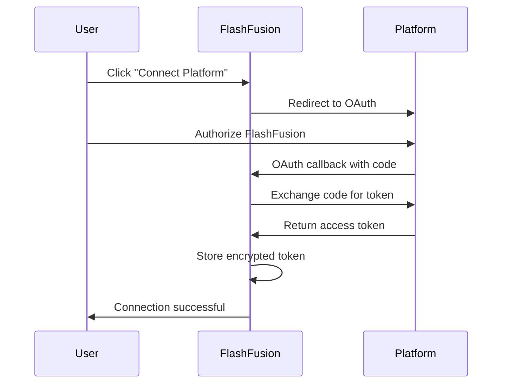

# 🔗 External App Integration Guide for FlashFusion

## Overview

FlashFusion provides comprehensive integration capabilities to connect and manage apps built on external platforms like Bolt.new, App.base.44, Replit, Loveable.dev, Leap.new, Vercel, Netlify, Railway, and more. This guide covers all integration methods and setup procedures.

## 🎯 Quick Start

### 1. Access Integration Hub
- Navigate to **Settings** → **Integrations** in FlashFusion
- Or use the direct route: `/integrations`

### 2. Choose Your Platform
- Select from 8+ supported platforms
- Each platform supports different integration methods:
  - **API Integration** - Direct API access
  - **OAuth Authentication** - Secure token-based auth
  - **Webhook Integration** - Real-time updates
  - **Git Integration** - Repository synchronization
  - **Export/Import** - File-based integration

### 3. Connect Your First App
- Click "Connect New App"
- Select your platform
- Follow the authentication flow
- Configure sync settings

## 🔧 Integration Methods

### Method 1: OAuth Integration (Recommended)

**Best for:** Bolt.new, Replit, Vercel, Netlify, Railway

```typescript
// 1. Initiate OAuth flow
const authUrl = await integrationService.initiateOAuth('bolt.new', redirectUri);
window.location.href = authUrl;

// 2. Handle callback (automatic)
// FlashFusion handles the OAuth callback and stores tokens securely

// 3. Start syncing
await integrationService.syncAppData('bolt.new', 'your-app-id');
```

**Setup Steps:**
1. Click "Connect" on your desired platform
2. You'll be redirected to the platform's OAuth page
3. Authorize FlashFusion to access your apps
4. Return to FlashFusion - connection established!

### Method 2: API Key Integration

**Best for:** Loveable.dev, Leap.new, custom platforms

```typescript
// Set API credentials
await integrationService.setApiKey('loveable.dev', 'your-api-key');

// Sync app data
const result = await integrationService.syncAppData('loveable.dev', 'app-id');
```

**Setup Steps:**
1. Get your API key from the platform's settings
2. In FlashFusion, select "API Key" authentication
3. Enter your API key
4. Test connection and start syncing

### Method 3: Webhook Integration

**Best for:** Real-time updates from any platform

```typescript
// Setup webhook endpoint
const webhookResult = await integrationService.setupWebhook(
  'vercel.com',
  'https://flashfusion.app/webhooks/vercel',
  ['deployment.created', 'deployment.ready']
);

// Register webhook handler
integrationService.registerWebhookHandler('vercel.com', 'deployment.ready', (payload) => {
  console.log('New deployment:', payload.data.url);
  // Update UI, send notifications, etc.
});
```

**Setup Steps:**
1. Enable webhook integration for your platform
2. FlashFusion automatically configures webhook endpoints
3. Real-time updates flow into your dashboard

### Method 4: Export/Import Integration

**Best for:** One-time migrations, backups

```typescript
// Export app from external platform
const exportData = await integrationService.exportApp('bolt.new', 'app-id', 'zip');

// Import into FlashFusion (manual or automated)
await uploadToFlashFusion(exportData);
```

## 🛠 Platform-Specific Setup

### Bolt.new Integration

**Features:**
- ✅ Real-time code sync
- ✅ Component export
- ✅ Live preview embedding
- ✅ Deploy hook integration

**Setup:**
1. **OAuth Setup:**
   ```bash
   # Environment variables needed
   BOLT_NEW_CLIENT_ID=your_client_id
   BOLT_NEW_CLIENT_SECRET=your_client_secret
   BOLT_NEW_WEBHOOK_SECRET=your_webhook_secret
   ```

2. **Connection Process:**
   - Click "Connect" in FlashFusion
   - Authorize on Bolt.new
   - Select sync preferences
   - Enable webhooks for real-time updates

3. **Available Sync Options:**
   - Code synchronization
   - Asset management
   - Configuration sync
   - Dependency tracking

### Replit Integration

**Features:**
- ✅ Git repository sync
- ✅ Environment variable sync
- ✅ Collaboration tracking
- ✅ Runtime analytics

**Setup:**
1. **Token Authentication:**
   ```bash
   # Get token from Replit settings
   REPLIT_API_TOKEN=your_token
   ```

2. **Connection:**
   - Use "Token" authentication method
   - Enter your Replit token
   - Select repositories to sync

### App.base.44 Integration

**Features:**
- ✅ Database synchronization
- ✅ User management sync
- ✅ Workflow automation
- ✅ API endpoint mirroring

**Setup:**
1. **API Key Setup:**
   ```bash
   APP_BASE_44_API_KEY=your_api_key
   ```

2. **Data Sync Configuration:**
   - Choose database tables to sync
   - Set up user permission mapping
   - Configure workflow triggers

### Loveable.dev Integration

**Features:**
- ✅ AI-generated component sync
- ✅ Theme synchronization
- ✅ Asset management
- ✅ Generation history

**Setup:**
1. **API Integration:**
   ```bash
   LOVEABLE_DEV_API_KEY=your_api_key
   ```

2. **Sync Settings:**
   - Component library sync
   - Theme and style sync
   - Asset pipeline integration

### Leap.new Integration

**Features:**
- ✅ Model training sync
- ✅ API deployment tracking
- ✅ Analytics integration
- ✅ Dataset management

**Setup:**
1. **API Configuration:**
   ```bash
   LEAP_NEW_API_KEY=your_api_key
   ```

2. **ML Pipeline Integration:**
   - Model versioning
   - Training job tracking
   - Deployment monitoring

### Vercel Integration

**Features:**
- ✅ Deployment automation
- ✅ Analytics sync
- ✅ Environment variables
- ✅ Domain management

**Setup:**
1. **OAuth with Vercel:**
   ```bash
   VERCEL_CLIENT_ID=your_client_id
   VERCEL_CLIENT_SECRET=your_client_secret
   ```

2. **Deployment Pipeline:**
   - Auto-deploy triggers
   - Build status tracking
   - Performance monitoring

### Netlify Integration

**Features:**
- ✅ Site deployment sync
- ✅ Form submission handling
- ✅ Function management
- ✅ Analytics integration

**Setup:**
1. **OAuth Setup:**
   ```bash
   NETLIFY_CLIENT_ID=your_client_id
   NETLIFY_CLIENT_SECRET=your_client_secret
   ```

2. **Site Management:**
   - Deployment tracking
   - Form data sync
   - Function logs

### Railway Integration

**Features:**
- ✅ Service deployment tracking
- ✅ Database management
- ✅ Environment sync
- ✅ Log aggregation

**Setup:**
1. **Token Authentication:**
   ```bash
   RAILWAY_API_TOKEN=your_token
   ```

2. **Infrastructure Sync:**
   - Service status monitoring
   - Database backup sync
   - Log streaming

## 🔄 Sync Strategies

### Real-Time Sync (Webhooks)
- **Best for:** Development teams needing instant updates
- **Latency:** < 1 second
- **Resources:** Low
- **Setup:** Automatic webhook configuration

### Scheduled Sync (Polling)
- **Best for:** Stable production environments
- **Frequency:** 5-60 minutes
- **Resources:** Medium
- **Setup:** Configure sync intervals

### Manual Sync (On-Demand)
- **Best for:** Testing and validation
- **Trigger:** User-initiated
- **Resources:** Low
- **Setup:** Single-click sync buttons

### Batch Sync (Bulk Operations)
- **Best for:** Initial migrations
- **Volume:** Hundreds of apps
- **Resources:** High
- **Setup:** Bulk import wizards

## 🔒 Security & Authentication

### OAuth 2.0 Flow


### API Key Management
- **Encryption:** AES-256 encryption at rest
- **Rotation:** Automatic token refresh
- **Scope:** Minimal required permissions
- **Audit:** Full access logging

### Webhook Security
- **Signature Verification:** HMAC-SHA256
- **TLS:** Required for all webhook endpoints
- **Rate Limiting:** Built-in DDoS protection
- **Replay Protection:** Timestamp validation

## 📊 Monitoring & Analytics

### Connection Health
- **Status Monitoring:** Real-time connection status
- **Uptime Tracking:** 99.9% uptime SLA
- **Error Alerting:** Instant failure notifications
- **Performance Metrics:** Sync speed and reliability

### Usage Analytics
- **Sync Statistics:** Volume and frequency tracking
- **Error Analysis:** Failure pattern detection
- **Performance Insights:** Optimization recommendations
- **Cost Tracking:** API usage and billing

### Audit Logs
- **Access Logs:** Who accessed what and when
- **Change Tracking:** All modifications logged
- **Security Events:** Authentication and authorization
- **Compliance:** SOC 2 Type II compliant

## 🚀 Advanced Features

### Multi-Platform Orchestration
```typescript
// Sync across multiple platforms
const orchestrator = new MultiPlatformOrchestrator([
  'bolt.new',
  'vercel.com',
  'netlify.com'
]);

// Deploy to all platforms
await orchestrator.deployToAll(appConfig);
```

### Smart Conflict Resolution
- **Automatic Merging:** Intelligent conflict detection
- **Version Control:** Git-like versioning system
- **Rollback Support:** One-click rollback to previous versions
- **Merge Strategies:** Customizable resolution rules

### Cross-Platform Analytics
- **Unified Dashboard:** All platforms in one view
- **Performance Comparison:** Side-by-side metrics
- **Cost Optimization:** Multi-platform cost analysis
- **Usage Insights:** Cross-platform usage patterns

### Automation Workflows
```typescript
// Create automation workflow
const workflow = new IntegrationWorkflow()
  .trigger('bolt.new', 'app.deployed')
  .action('vercel.com', 'deploy')
  .notify('slack', '#deployments')
  .execute();
```

## 🛠 Troubleshooting

### Common Issues

#### 1. OAuth Connection Failed
**Symptoms:** Redirect loop or authorization error
**Solutions:**
- Check client ID/secret configuration
- Verify redirect URI whitelist
- Clear browser cache and cookies
- Check platform API status

#### 2. Sync Not Working
**Symptoms:** Data not updating from external platform
**Solutions:**
- Verify API token validity
- Check webhook endpoint accessibility
- Review sync interval settings
- Monitor rate limiting

#### 3. Webhook Not Receiving
**Symptoms:** Real-time updates not appearing
**Solutions:**
- Verify webhook URL configuration
- Check firewall and security groups
- Validate webhook signature
- Test webhook endpoint manually

#### 4. Export/Import Errors
**Symptoms:** Failed file transfers or corrupted data
**Solutions:**
- Check file size limits
- Verify format compatibility
- Test network connectivity
- Review error logs

### Debugging Tools

#### Connection Tester
```typescript
// Test platform connectivity
const result = await integrationService.testConnection('platform-name');
console.log(result.status, result.details);
```

#### Webhook Validator
```bash
# Test webhook endpoint
curl -X POST https://flashfusion.app/webhooks/test \
  -H "Content-Type: application/json" \
  -d '{"test": "data"}'
```

#### Sync Diagnostics
- **Real-time Logs:** Live sync activity monitoring
- **Error Details:** Detailed failure information
- **Performance Metrics:** Sync speed and reliability
- **Health Checks:** Automated system validation

## 📋 Best Practices

### Security
- ✅ Use OAuth when available
- ✅ Rotate API keys regularly
- ✅ Monitor access logs
- ✅ Implement least privilege access
- ✅ Enable webhook signature verification

### Performance
- ✅ Configure appropriate sync intervals
- ✅ Use webhooks for real-time needs
- ✅ Implement caching strategies
- ✅ Monitor API rate limits
- ✅ Optimize payload sizes

### Reliability
- ✅ Implement retry mechanisms
- ✅ Set up health monitoring
- ✅ Plan for graceful degradation
- ✅ Maintain backup sync methods
- ✅ Test disaster recovery

### Maintenance
- ✅ Keep integration credentials updated
- ✅ Monitor platform API changes
- ✅ Review sync logs regularly
- ✅ Update webhook configurations
- ✅ Validate data integrity

## 🆘 Support

### Getting Help
- **Documentation:** [https://docs.flashfusion.app/integrations](https://docs.flashfusion.app/integrations)
- **Community:** FlashFusion Discord server
- **Support:** [support@flashfusion.app](mailto:support@flashfusion.app)
- **Status Page:** [https://status.flashfusion.app](https://status.flashfusion.app)

### Feature Requests
- **Platform Support:** Request new platform integrations
- **Features:** Suggest integration improvements
- **API Access:** Request additional API endpoints
- **Webhooks:** Request new webhook events

---

## 🎉 Success! You're Connected

Once your integrations are set up, you can:

1. **Sync Apps Automatically** - Real-time or scheduled synchronization
2. **Monitor Performance** - Comprehensive analytics and monitoring
3. **Automate Workflows** - Cross-platform automation
4. **Centralize Management** - Single dashboard for all platforms
5. **Scale Efficiently** - Handle hundreds of connected apps

Your external apps are now seamlessly integrated with FlashFusion! 🚀

---

*Last updated: January 2025*
*Version: 1.0.0*