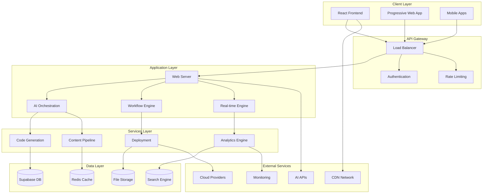
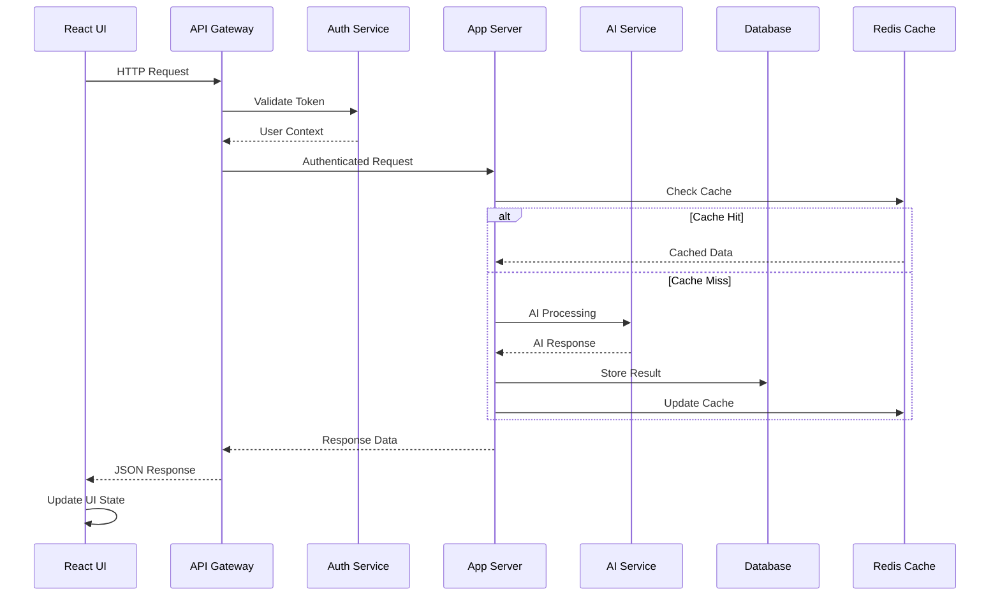

# FlashFusion Architecture Overview

Comprehensive technical overview of FlashFusion's system architecture, design patterns, and implementation details.

## 🏗️ High-Level System Architecture

### System Overview

FlashFusion employs a modern, scalable architecture designed to handle complex AI workflows, real-time collaboration, and multi-tenant deployments.



### Architecture Principles

**1. Microservices Architecture**
- Loosely coupled, independently deployable services
- Service-oriented design with clear boundaries
- API-first approach for all service interactions
- Independent scaling and technology choices

**2. Event-Driven Design**
- Asynchronous event processing for scalability
- Real-time updates through WebSocket connections
- Event sourcing for audit trails and state reconstruction
- Message queuing for reliable processing

**3. Multi-Tenant SaaS**
- Tenant isolation at data and application levels
- Shared infrastructure with isolated customer data
- Configurable features per tenant/organization
- Resource quotas and usage tracking

**4. AI-First Architecture**
- AI services as first-class citizens in the architecture
- Intelligent routing and load balancing for AI requests
- Model management and version control
- Fallback and retry mechanisms for AI failures

## 🎯 Core Components

### 1. Frontend Architecture (React + TypeScript)

#### Component Hierarchy
```
App (Root)
├── Providers
│   ├── ConfigProvider (Global configuration)
│   ├── FeatureFlagProvider (Feature toggles)
│   └── GamificationProvider (XP and achievements)
├── Layout Components
│   ├── Navigation (Main navigation)
│   ├── Sidebar (Contextual navigation)
│   └── AppFooter (Footer with links)
├── Core Pages
│   ├── Dashboard (Main overview)
│   ├── Multi-Agent Orchestration
│   ├── Creator Content Pipeline
│   ├── Full-Stack Builder
│   └── Analytics Dashboard
└── Shared Components
    ├── UI Components (Reusable interface elements)
    ├── Business Components (Domain-specific)
    └── Integration Components (External services)
```

#### State Management Architecture
```typescript
// Global State Structure
interface GlobalState {
  // User and authentication
  auth: {
    user: User | null;
    session: Session | null;
    permissions: Permission[];
  };
  
  // Application state
  app: {
    currentPage: string;
    loading: boolean;
    error: AppError | null;
    connectionStatus: 'connected' | 'disconnected' | 'reconnecting';
  };
  
  // Feature flags and configuration
  config: {
    features: Record<string, boolean>;
    environment: 'development' | 'staging' | 'production';
    apiEndpoints: Record<string, string>;
  };
  
  // Gamification state
  gamification: {
    xp: number;
    level: number;
    achievements: Achievement[];
    dailyTasks: Task[];
  };
  
  // Real-time collaboration
  collaboration: {
    activeUsers: User[];
    cursors: Record<string, CursorPosition>;
    changes: Change[];
  };
}
```

#### Component Design Patterns

**1. Container/Presentation Pattern**
```typescript
// Container Component (Logic)
function UserProfileContainer() {
  const { user, loading, error, updateUser } = useUser();
  const { permissions } = usePermissions();
  
  return (
    <UserProfilePresentation
      user={user}
      loading={loading}
      error={error}
      permissions={permissions}
      onUpdateUser={updateUser}
    />
  );
}

// Presentation Component (UI Only)
function UserProfilePresentation({ user, loading, error, onUpdateUser }) {
  if (loading) return <LoadingSpinner />;
  if (error) return <ErrorMessage error={error} />;
  if (!user) return <EmptyState />;
  
  return (
    <Card>
      {/* UI Implementation */}
    </Card>
  );
}
```

**2. Compound Component Pattern**
```typescript
// Modal Compound Component
const Modal = {
  Root: ModalRoot,
  Trigger: ModalTrigger,
  Content: ModalContent,
  Header: ModalHeader,
  Body: ModalBody,
  Footer: ModalFooter,
  Close: ModalClose,
};

// Usage
<Modal.Root>
  <Modal.Trigger>
    <Button>Open Modal</Button>
  </Modal.Trigger>
  <Modal.Content>
    <Modal.Header>
      <h2>Modal Title</h2>
      <Modal.Close />
    </Modal.Header>
    <Modal.Body>
      <p>Modal content goes here</p>
    </Modal.Body>
    <Modal.Footer>
      <Button>Action</Button>
    </Modal.Footer>
  </Modal.Content>
</Modal.Root>
```

**3. Custom Hook Pattern**
```typescript
// Custom Hook for API Integration
function useAIService(model: AIModel) {
  const [state, setState] = useState<AIServiceState>({
    loading: false,
    error: null,
    result: null,
  });
  
  const generate = useCallback(async (prompt: string) => {
    setState(prev => ({ ...prev, loading: true, error: null }));
    
    try {
      const result = await aiService.generate(model, prompt);
      setState({ loading: false, error: null, result });
    } catch (error) {
      setState({ 
        loading: false, 
        error: error instanceof Error ? error : new Error('Unknown error'),
        result: null 
      });
    }
  }, [model]);
  
  return { ...state, generate };
}
```

### 2. Backend Architecture (Supabase + Edge Functions)

#### Database Schema Design
```sql
-- Core Tables
CREATE TABLE users (
  id UUID PRIMARY KEY DEFAULT gen_random_uuid(),
  email TEXT UNIQUE NOT NULL,
  name TEXT,
  avatar_url TEXT,
  role TEXT DEFAULT 'user',
  organization_id UUID REFERENCES organizations(id),
  created_at TIMESTAMP WITH TIME ZONE DEFAULT NOW(),
  updated_at TIMESTAMP WITH TIME ZONE DEFAULT NOW()
);

CREATE TABLE organizations (
  id UUID PRIMARY KEY DEFAULT gen_random_uuid(),
  name TEXT NOT NULL,
  slug TEXT UNIQUE NOT NULL,
  plan TEXT DEFAULT 'starter',
  settings JSONB DEFAULT '{}',
  created_at TIMESTAMP WITH TIME ZONE DEFAULT NOW()
);

CREATE TABLE projects (
  id UUID PRIMARY KEY DEFAULT gen_random_uuid(),
  name TEXT NOT NULL,
  description TEXT,
  type TEXT NOT NULL,
  config JSONB DEFAULT '{}',
  owner_id UUID REFERENCES users(id) NOT NULL,
  organization_id UUID REFERENCES organizations(id),
  created_at TIMESTAMP WITH TIME ZONE DEFAULT NOW(),
  updated_at TIMESTAMP WITH TIME ZONE DEFAULT NOW()
);

-- AI and Content Tables
CREATE TABLE ai_generations (
  id UUID PRIMARY KEY DEFAULT gen_random_uuid(),
  user_id UUID REFERENCES users(id) NOT NULL,
  project_id UUID REFERENCES projects(id),
  type TEXT NOT NULL,
  prompt TEXT NOT NULL,
  result JSONB,
  model TEXT NOT NULL,
  tokens_used INTEGER,
  cost DECIMAL(10,4),
  created_at TIMESTAMP WITH TIME ZONE DEFAULT NOW()
);

CREATE TABLE content_items (
  id UUID PRIMARY KEY DEFAULT gen_random_uuid(),
  title TEXT NOT NULL,
  content TEXT,
  type TEXT NOT NULL,
  platform TEXT,
  status TEXT DEFAULT 'draft',
  metadata JSONB DEFAULT '{}',
  user_id UUID REFERENCES users(id) NOT NULL,
  project_id UUID REFERENCES projects(id),
  created_at TIMESTAMP WITH TIME ZONE DEFAULT NOW(),
  published_at TIMESTAMP WITH TIME ZONE
);

-- Collaboration Tables
CREATE TABLE project_members (
  id UUID PRIMARY KEY DEFAULT gen_random_uuid(),
  project_id UUID REFERENCES projects(id) NOT NULL,
  user_id UUID REFERENCES users(id) NOT NULL,
  role TEXT DEFAULT 'viewer',
  permissions JSONB DEFAULT '{}',
  invited_at TIMESTAMP WITH TIME ZONE DEFAULT NOW(),
  joined_at TIMESTAMP WITH TIME ZONE,
  UNIQUE(project_id, user_id)
);

-- Analytics and Usage Tables
CREATE TABLE usage_metrics (
  id UUID PRIMARY KEY DEFAULT gen_random_uuid(),
  user_id UUID REFERENCES users(id),
  organization_id UUID REFERENCES organizations(id),
  metric_type TEXT NOT NULL,
  metric_value DECIMAL,
  metadata JSONB DEFAULT '{}',
  recorded_at TIMESTAMP WITH TIME ZONE DEFAULT NOW()
);

-- Gamification Tables
CREATE TABLE user_achievements (
  id UUID PRIMARY KEY DEFAULT gen_random_uuid(),
  user_id UUID REFERENCES users(id) NOT NULL,
  achievement_type TEXT NOT NULL,
  achievement_data JSONB DEFAULT '{}',
  earned_at TIMESTAMP WITH TIME ZONE DEFAULT NOW(),
  UNIQUE(user_id, achievement_type)
);
```

#### Edge Functions Architecture
```typescript
// Hono Web Server Structure
import { Hono } from 'hono';
import { cors } from 'hono/cors';
import { logger } from 'hono/logger';

const app = new Hono();

// Middleware
app.use('*', cors({
  origin: ['http://localhost:5173', 'https://flashfusion.com'],
  credentials: true,
}));
app.use('*', logger());

// Authentication middleware
app.use('/api/*', async (c, next) => {
  const auth = await validateAuth(c);
  if (!auth.user) {
    return c.json({ error: 'Unauthorized' }, 401);
  }
  c.set('user', auth.user);
  await next();
});

// Routes
app.route('/api/ai', aiRoutes);
app.route('/api/projects', projectRoutes);
app.route('/api/content', contentRoutes);
app.route('/api/deployments', deploymentRoutes);
app.route('/api/analytics', analyticsRoutes);

// Error handling
app.onError((err, c) => {
  console.error('Server error:', err);
  return c.json({ error: 'Internal server error' }, 500);
});

Deno.serve(app.fetch);
```

### 3. AI Orchestration Engine

#### Multi-Agent Architecture
```typescript
interface Agent {
  id: string;
  name: string;
  type: AgentType;
  capabilities: Capability[];
  model: AIModel;
  status: 'idle' | 'busy' | 'error';
  metrics: AgentMetrics;
}

interface Workflow {
  id: string;
  name: string;
  steps: WorkflowStep[];
  triggers: Trigger[];
  status: WorkflowStatus;
  metadata: WorkflowMetadata;
}

class AIOrchestrator {
  private agents: Map<string, Agent> = new Map();
  private workflows: Map<string, Workflow> = new Map();
  private eventBus: EventBus;
  
  async executeWorkflow(workflowId: string, input: any): Promise<any> {
    const workflow = this.workflows.get(workflowId);
    if (!workflow) throw new Error('Workflow not found');
    
    const context = new ExecutionContext(workflow, input);
    
    for (const step of workflow.steps) {
      const agent = await this.selectBestAgent(step.requirements);
      const result = await agent.execute(step, context);
      context.addResult(step.id, result);
    }
    
    return context.getFinalResult();
  }
  
  private async selectBestAgent(requirements: AgentRequirements): Promise<Agent> {
    const candidates = Array.from(this.agents.values())
      .filter(agent => this.meetsRequirements(agent, requirements))
      .sort((a, b) => this.scoreAgent(b, requirements) - this.scoreAgent(a, requirements));
    
    if (candidates.length === 0) {
      throw new Error('No suitable agent available');
    }
    
    return candidates[0];
  }
}
```

#### AI Model Management
```typescript
class AIModelManager {
  private models: Map<string, AIModelConfig> = new Map();
  private loadBalancer: LoadBalancer;
  private fallbackChain: string[];
  
  async execute(
    modelId: string, 
    prompt: string, 
    options: ExecutionOptions
  ): Promise<AIResponse> {
    const model = this.models.get(modelId);
    if (!model) throw new Error(`Model ${modelId} not found`);
    
    try {
      return await this.executeWithRetry(model, prompt, options);
    } catch (error) {
      return await this.executeFallback(modelId, prompt, options, error);
    }
  }
  
  private async executeWithRetry(
    model: AIModelConfig,
    prompt: string,
    options: ExecutionOptions,
    retries = 3
  ): Promise<AIResponse> {
    for (let i = 0; i <= retries; i++) {
      try {
        const response = await model.client.generate(prompt, options);
        
        // Track metrics
        await this.trackUsage(model.id, {
          tokens: response.tokens,
          cost: response.cost,
          latency: response.latency,
          success: true
        });
        
        return response;
      } catch (error) {
        if (i === retries) throw error;
        await this.delay(Math.pow(2, i) * 1000); // Exponential backoff
      }
    }
  }
}
```

### 4. Real-Time Collaboration System

#### WebSocket Architecture
```typescript
class CollaborationServer {
  private rooms: Map<string, Room> = new Map();
  private connections: Map<string, WebSocket> = new Map();
  
  handleConnection(ws: WebSocket, userId: string, projectId: string) {
    const room = this.getOrCreateRoom(projectId);
    room.addUser(userId, ws);
    
    ws.onmessage = (event) => {
      const message = JSON.parse(event.data);
      this.handleMessage(room, userId, message);
    };
    
    ws.onclose = () => {
      room.removeUser(userId);
      this.cleanupEmptyRooms();
    };
  }
  
  private handleMessage(room: Room, userId: string, message: Message) {
    switch (message.type) {
      case 'cursor_move':
        room.broadcast({
          type: 'cursor_update',
          userId,
          position: message.position
        }, [userId]);
        break;
        
      case 'text_change':
        const operation = this.applyOperationalTransform(
          message.operation,
          room.getPendingOperations()
        );
        room.applyOperation(operation);
        room.broadcast({
          type: 'operation_applied',
          operation
        }, [userId]);
        break;
        
      case 'voice_start':
        room.startVoiceSession(userId, message.channelId);
        break;
    }
  }
}
```

#### Operational Transform
```typescript
class OperationalTransform {
  static transform(op1: Operation, op2: Operation): [Operation, Operation] {
    // Implementation of operational transformation algorithm
    // for conflict-free collaborative editing
    
    if (op1.type === 'insert' && op2.type === 'insert') {
      if (op1.position <= op2.position) {
        return [
          op1,
          { ...op2, position: op2.position + op1.text.length }
        ];
      } else {
        return [
          { ...op1, position: op1.position + op2.text.length },
          op2
        ];
      }
    }
    
    // Handle other operation types (delete, retain, etc.)
    return this.transformByType(op1, op2);
  }
}
```

## 🔄 Data Flow Architecture

### Request/Response Flow



### Event-Driven Architecture

```typescript
// Event System
interface DomainEvent {
  id: string;
  type: string;
  aggregateId: string;
  payload: any;
  timestamp: Date;
  userId?: string;
}

class EventBus {
  private handlers: Map<string, EventHandler[]> = new Map();
  
  subscribe<T extends DomainEvent>(
    eventType: string, 
    handler: EventHandler<T>
  ): void {
    const handlers = this.handlers.get(eventType) || [];
    handlers.push(handler);
    this.handlers.set(eventType, handlers);
  }
  
  async publish<T extends DomainEvent>(event: T): Promise<void> {
    const handlers = this.handlers.get(event.type) || [];
    
    await Promise.all(
      handlers.map(handler => 
        this.safeExecute(() => handler.handle(event))
      )
    );
    
    // Persist event for event sourcing
    await this.persistEvent(event);
  }
}

// Example Event Handlers
class ProjectCreatedHandler implements EventHandler<ProjectCreatedEvent> {
  async handle(event: ProjectCreatedEvent): Promise<void> {
    // Create default project structure
    await this.projectService.initializeProject(event.projectId);
    
    // Send welcome email
    await this.emailService.sendProjectWelcome(
      event.userId, 
      event.projectId
    );
    
    // Track analytics
    await this.analyticsService.trackProjectCreation(event);
  }
}
```

### Caching Strategy

```typescript
// Multi-layer Caching
class CacheManager {
  private l1Cache: Map<string, any> = new Map(); // In-memory
  private l2Cache: RedisClient; // Redis
  private l3Cache: CDNService; // CDN
  
  async get<T>(key: string): Promise<T | null> {
    // L1: In-memory cache (fastest)
    if (this.l1Cache.has(key)) {
      return this.l1Cache.get(key);
    }
    
    // L2: Redis cache (fast)
    const l2Value = await this.l2Cache.get(key);
    if (l2Value) {
      this.l1Cache.set(key, l2Value);
      return JSON.parse(l2Value);
    }
    
    // L3: CDN/Database (slower)
    const l3Value = await this.l3Cache.get(key);
    if (l3Value) {
      await this.set(key, l3Value, { ttl: 3600 });
      return l3Value;
    }
    
    return null;
  }
  
  async set(key: string, value: any, options: CacheOptions = {}): Promise<void> {
    // Set in all cache layers
    this.l1Cache.set(key, value);
    await this.l2Cache.setex(key, options.ttl || 3600, JSON.stringify(value));
    
    if (options.cdn) {
      await this.l3Cache.set(key, value);
    }
  }
}
```

## 🔐 Security Architecture

### Authentication & Authorization

```typescript
// JWT Token Structure
interface JWTPayload {
  sub: string; // User ID
  org: string; // Organization ID
  role: string; // User role
  permissions: string[]; // Specific permissions
  iat: number; // Issued at
  exp: number; // Expires at
  scope: string[]; // API scopes
}

// Permission System
class PermissionManager {
  private permissions: Map<string, Permission> = new Map();
  
  async checkPermission(
    userId: string, 
    resource: string, 
    action: string
  ): Promise<boolean> {
    const user = await this.getUserContext(userId);
    const permission = this.permissions.get(`${resource}:${action}`);
    
    if (!permission) return false;
    
    return this.evaluatePermission(user, permission);
  }
  
  private evaluatePermission(
    user: UserContext, 
    permission: Permission
  ): boolean {
    // Role-based permissions
    if (permission.roles.includes(user.role)) {
      return true;
    }
    
    // Resource-based permissions
    if (permission.resourceOwner && user.id === permission.ownerId) {
      return true;
    }
    
    // Organization-level permissions
    if (permission.organizationLevel && user.organizationRole) {
      return permission.organizationRoles.includes(user.organizationRole);
    }
    
    return false;
  }
}
```

### Data Encryption

```typescript
// Encryption Service
class EncryptionService {
  private readonly algorithm = 'aes-256-gcm';
  private masterKey: Buffer;
  
  encrypt(data: string): EncryptedData {
    const iv = crypto.randomBytes(16);
    const key = this.deriveKey(iv);
    const cipher = crypto.createCipher(this.algorithm, key);
    
    let encrypted = cipher.update(data, 'utf8', 'hex');
    encrypted += cipher.final('hex');
    
    const authTag = cipher.getAuthTag();
    
    return {
      data: encrypted,
      iv: iv.toString('hex'),
      authTag: authTag.toString('hex')
    };
  }
  
  decrypt(encryptedData: EncryptedData): string {
    const key = this.deriveKey(Buffer.from(encryptedData.iv, 'hex'));
    const decipher = crypto.createDecipher(this.algorithm, key);
    
    decipher.setAuthTag(Buffer.from(encryptedData.authTag, 'hex'));
    
    let decrypted = decipher.update(encryptedData.data, 'hex', 'utf8');
    decrypted += decipher.final('utf8');
    
    return decrypted;
  }
}
```

## 📈 Scalability & Performance

### Horizontal Scaling Strategy

```typescript
// Load Balancing Configuration
interface LoadBalancerConfig {
  strategy: 'round-robin' | 'least-connections' | 'ip-hash' | 'weighted';
  healthCheck: {
    path: string;
    interval: number;
    timeout: number;
    retries: number;
  };
  servers: ServerConfig[];
}

class LoadBalancer {
  private servers: ServerPool;
  private strategy: LoadBalancingStrategy;
  
  async route(request: Request): Promise<Response> {
    const server = await this.strategy.selectServer(this.servers);
    
    if (!server.isHealthy()) {
      throw new Error('No healthy servers available');
    }
    
    return await this.forwardRequest(request, server);
  }
  
  private async healthCheck(server: ServerConfig): Promise<boolean> {
    try {
      const response = await fetch(`${server.url}/health`, {
        timeout: this.config.healthCheck.timeout
      });
      return response.ok;
    } catch {
      return false;
    }
  }
}
```

### Database Scaling

```sql
-- Database Partitioning Strategy
-- Partition by organization for tenant isolation
CREATE TABLE projects_partitioned (
    id UUID,
    organization_id UUID,
    name TEXT,
    created_at TIMESTAMP WITH TIME ZONE
) PARTITION BY HASH (organization_id);

-- Create partitions
CREATE TABLE projects_partition_0 PARTITION OF projects_partitioned
    FOR VALUES WITH (MODULUS 4, REMAINDER 0);
    
CREATE TABLE projects_partition_1 PARTITION OF projects_partitioned
    FOR VALUES WITH (MODULUS 4, REMAINDER 1);

-- Indexes for optimal query performance
CREATE INDEX CONCURRENTLY idx_projects_org_created 
    ON projects_partitioned (organization_id, created_at DESC);
    
CREATE INDEX CONCURRENTLY idx_projects_search 
    ON projects_partitioned USING GIN (to_tsvector('english', name || ' ' || description));
```

### CDN and Asset Optimization

```typescript
// Asset Optimization Pipeline
class AssetOptimizer {
  async optimizeImage(image: File): Promise<OptimizedAsset> {
    const formats = ['webp', 'avif', 'jpeg'];
    const sizes = [400, 800, 1200, 1600];
    
    const optimized = await Promise.all(
      formats.flatMap(format =>
        sizes.map(async size => {
          const resized = await this.resizeImage(image, size);
          const compressed = await this.compressImage(resized, format);
          
          return {
            format,
            size,
            url: await this.uploadToCDN(compressed),
            bytes: compressed.size
          };
        })
      )
    );
    
    return {
      original: await this.uploadToCDN(image),
      variants: optimized,
      srcSet: this.generateSrcSet(optimized)
    };
  }
}
```

## 🔍 Monitoring & Observability

### Application Performance Monitoring

```typescript
// Metrics Collection
class MetricsCollector {
  private metrics: Map<string, Metric> = new Map();
  
  recordTiming(name: string, duration: number, tags: Tags = {}): void {
    const metric = this.getOrCreateMetric(name, 'timing');
    metric.record(duration, tags);
  }
  
  increment(name: string, value = 1, tags: Tags = {}): void {
    const metric = this.getOrCreateMetric(name, 'counter');
    metric.increment(value, tags);
  }
  
  gauge(name: string, value: number, tags: Tags = {}): void {
    const metric = this.getOrCreateMetric(name, 'gauge');
    metric.set(value, tags);
  }
  
  async flush(): Promise<void> {
    const data = Array.from(this.metrics.values()).map(m => m.serialize());
    await this.send(data);
    this.metrics.clear();
  }
}

// Performance Middleware
function performanceMiddleware() {
  return async (req: Request, res: Response, next: NextFunction) => {
    const startTime = Date.now();
    
    res.on('finish', () => {
      const duration = Date.now() - startTime;
      
      metrics.recordTiming('http_request_duration', duration, {
        method: req.method,
        route: req.route?.path || 'unknown',
        status: res.statusCode.toString()
      });
      
      metrics.increment('http_requests_total', 1, {
        method: req.method,
        status: res.statusCode.toString()
      });
    });
    
    next();
  };
}
```

### Error Tracking and Alerting

```typescript
// Error Handling System
class ErrorTracker {
  private errorHandlers: Map<string, ErrorHandler> = new Map();
  private alertThresholds: Map<string, AlertConfig> = new Map();
  
  async trackError(error: Error, context: ErrorContext): Promise<void> {
    const errorData = {
      message: error.message,
      stack: error.stack,
      timestamp: new Date(),
      context,
      fingerprint: this.generateFingerprint(error)
    };
    
    // Store error
    await this.persistError(errorData);
    
    // Check alert thresholds
    await this.checkAlertThresholds(errorData);
    
    // Trigger error handlers
    const handlers = this.errorHandlers.get(error.constructor.name) || [];
    await Promise.all(handlers.map(h => h.handle(errorData)));
  }
  
  private async checkAlertThresholds(error: ErrorData): Promise<void> {
    const recentErrors = await this.getRecentErrors(error.fingerprint, 300); // 5 minutes
    
    if (recentErrors.length >= 10) {
      await this.sendAlert({
        type: 'error_spike',
        message: `Error spike detected: ${error.message}`,
        count: recentErrors.length,
        timeWindow: 300
      });
    }
  }
}
```

## 🔮 Future Architecture Considerations

### Microservices Evolution

```typescript
// Service Mesh Integration
interface ServiceMesh {
  serviceName: string;
  version: string;
  endpoints: ServiceEndpoint[];
  dependencies: ServiceDependency[];
  metrics: ServiceMetrics;
  healthCheck: HealthCheckConfig;
}

// Potential Service Breakdown
const services = [
  {
    name: 'user-service',
    responsibilities: ['Authentication', 'User Management', 'Permissions']
  },
  {
    name: 'ai-orchestration-service',
    responsibilities: ['AI Model Management', 'Workflow Execution', 'Agent Coordination']
  },
  {
    name: 'content-service',
    responsibilities: ['Content Generation', 'Content Management', 'Brand Voice']
  },
  {
    name: 'deployment-service',
    responsibilities: ['Application Deployment', 'Infrastructure Management', 'CI/CD']
  },
  {
    name: 'analytics-service',
    responsibilities: ['Metrics Collection', 'Reporting', 'Business Intelligence']
  }
];
```

### Edge Computing Integration

```typescript
// Edge Function Architecture
class EdgeFunctionManager {
  private regions: Map<string, EdgeRegion> = new Map();
  
  async deployToEdge(
    functionCode: string, 
    regions: string[]
  ): Promise<EdgeDeployment> {
    const deployments = await Promise.all(
      regions.map(region => 
        this.deployToRegion(functionCode, region)
      )
    );
    
    return {
      id: generateId(),
      deployments,
      globalUrl: this.createGlobalUrl(deployments),
      createdAt: new Date()
    };
  }
}
```

### AI Model Pipeline

```typescript
// Future AI Architecture
interface AIModelPipeline {
  preprocessing: PreprocessingStep[];
  models: AIModelChain[];
  postprocessing: PostprocessingStep[];
  validation: ValidationStep[];
  monitoring: ModelMonitoring;
}

class AdvancedAIOrchestrator {
  async executeModelChain(
    input: any, 
    pipeline: AIModelPipeline
  ): Promise<AIChainResult> {
    let data = input;
    
    // Preprocessing
    for (const step of pipeline.preprocessing) {
      data = await step.process(data);
    }
    
    // Model execution with ensemble methods
    const modelResults = await Promise.all(
      pipeline.models.map(model => model.execute(data))
    );
    
    // Ensemble result combination
    data = await this.combineResults(modelResults);
    
    // Postprocessing
    for (const step of pipeline.postprocessing) {
      data = await step.process(data);
    }
    
    // Validation
    const validationResults = await Promise.all(
      pipeline.validation.map(validator => validator.validate(data))
    );
    
    return {
      result: data,
      confidence: this.calculateConfidence(modelResults),
      validationResults,
      metadata: this.collectMetadata(pipeline, modelResults)
    };
  }
}
```

---

This architecture overview provides the technical foundation for understanding FlashFusion's design decisions, implementation patterns, and scalability strategies. The system is designed to grow from a single-tenant application to a multi-tenant SaaS platform serving thousands of users simultaneously.

*For more detailed technical documentation, see the [Technical Reference](./technical/) section.*