# FlashFusion Complete User Flow Documentation

## Overview
FlashFusion is a comprehensive AI-powered platform for generating web applications across multiple frameworks and platforms, featuring 60+ AI tools, gamification systems, real-time collaboration, and automated deployment capabilities.

## Table of Contents
1. [Application Architecture](#application-architecture)
2. [User Journey Overview](#user-journey-overview)
3. [Core System Apps Flows](#core-system-apps-flows)
4. [AI Tools User Flows](#ai-tools-user-flows)
5. [Creator Economy Flows](#creator-economy-flows)
6. [Advanced Features Flows](#advanced-features-flows)
7. [Integration & Deployment Flows](#integration--deployment-flows)
8. [Mobile Experience Flows](#mobile-experience-flows)
9. [Error Handling & Recovery](#error-handling--recovery)
10. [Analytics & Monitoring](#analytics--monitoring)

---

## Application Architecture

### Core Navigation Structure
```
FlashFusion Platform
├── Public Routes (Unauthenticated)
│   ├── Home Landing Page
│   ├── Features Showcase
│   ├── Pricing Tiers
│   ├── About & Company
│   ├── Contact Support
│   ├── Testimonials
│   ├── FAQ
│   ├── Legal (Terms, Privacy)
│   └── Interactive Demo
├── Authentication System
│   ├── Sign Up Flow
│   ├── Login Flow
│   ├── Password Reset
│   ├── Email Verification
│   └── Social OAuth (Google, GitHub)
├── Core System Apps (Authenticated)
│   ├── 1. Notification & Activity Center
│   ├── 2. User Profile & Settings Hub
│   ├── 3. Global Search & Command Palette
│   ├── 4. Plugin Manager & Integration Hub
│   ├── 5. Data Import/Export Hub
│   ├── 6. Analytics & Insights Dashboard
│   └── 7. Cross-App Workspace Dashboard
├── AI Tools Hub (60+ Tools)
│   ├── Generation Tools (Code, Apps, Content)
│   ├── Design Tools (Logos, Images, UI)
│   ├── Optimization Tools (Performance, SEO)
│   ├── Analysis Tools (Security, Quality)
│   ├── Automation Tools (CI/CD, Deploy)
│   └── Collaboration Tools (Review, Docs)
├── Creator Economy Suite
│   ├── Content Creation Pipeline
│   ├── Multi-Platform Publishing
│   ├── Brand Kit Generator
│   ├── Print-on-Demand Integration
│   └── Revenue Analytics
├── Validation & Intelligence
│   ├── AI Validation Engine
│   ├── Business Idea Validator
│   ├── Market Research Tools
│   └── Competitive Analysis
└── Advanced Features
    ├── Multi-Agent Orchestration
    ├── Real-time Collaboration
    ├── Deployment Management
    ├── Team Workspaces
    └── Enterprise Features
```

---

## User Journey Overview

### 1. Discovery & First Impression (0-5 minutes)
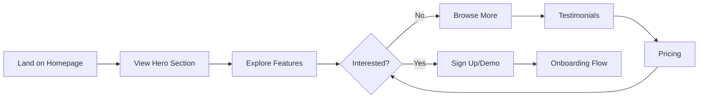

**Key Touchpoints:**
- **Hero Section**: Clear value proposition with animated demo
- **Interactive Demo**: Live preview without signup
- **Social Proof**: Testimonials and usage statistics
- **Clear CTAs**: "Start Building" and "See Demo"

### 2. Onboarding Experience (5-15 minutes)
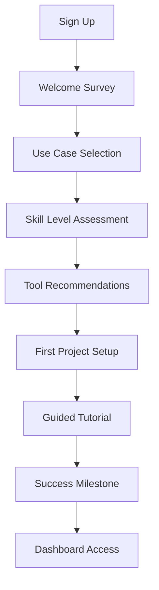

**Flow Details:**
1. **Account Creation**
   - Email/password or social login
   - Basic profile information
   - Email verification (optional skip)

2. **Personalization Survey**
   - Primary use case (SaaS, E-commerce, Content, etc.)
   - Technical skill level (Beginner, Intermediate, Expert)
   - Team size and role
   - Preferred frameworks/technologies

3. **Customized Setup**
   - Recommended tools based on survey
   - Workspace configuration
   - Integration preferences
   - Notification settings

4. **Guided First Project**
   - Choose starter template
   - Walk through tool usage
   - Generate first output
   - Celebrate success with animation

### 3. Core Platform Navigation (Daily Usage)
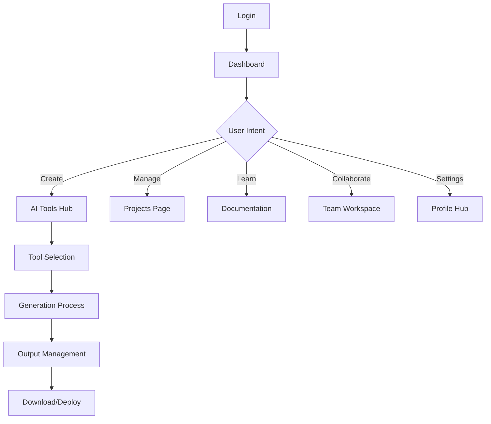

---

## Core System Apps Flows

### 1. Notification & Activity Center

#### Architecture & Features
```typescript
interface NotificationCenter {
  realTimeUpdates: {
    systemAlerts: SystemNotification[];
    projectUpdates: ProjectNotification[];
    collaborationInvites: CollaborationNotification[];
    achievementUnlocks: AchievementNotification[];
    deploymentStatus: DeploymentNotification[];
  };
  
  activityFeed: {
    userActions: UserActivity[];
    teamActivities: TeamActivity[];
    systemEvents: SystemEvent[];
    integrationEvents: IntegrationEvent[];
  };
  
  managementControls: {
    notificationPreferences: NotificationSettings;
    activityFilters: FilterOptions;
    digestSettings: DigestConfiguration;
    privacyControls: PrivacySettings;
  };
}
```

#### User Flow
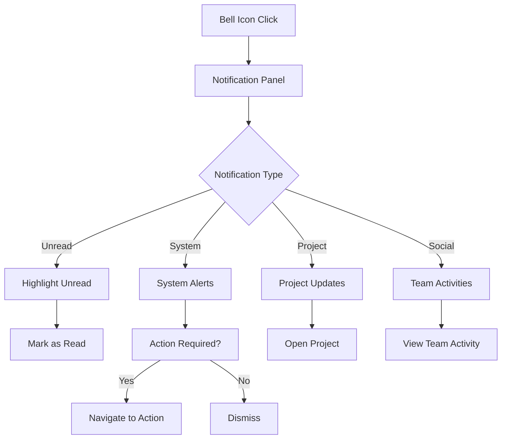

**Key Features:**
- **Real-time WebSocket updates**
- **Smart batching** to prevent notification spam
- **Action buttons** for quick responses
- **Digest summaries** for less urgent updates
- **Cross-device synchronization**

#### Implementation Locations
- **Component**: `/components/notifications/NotificationCenter.tsx`
- **Integration**: Header navigation bell icon
- **Real-time**: WebSocket connection for live updates
- **Persistence**: Supabase for notification history

### 2. User Profile & Settings Hub

#### Comprehensive Settings Architecture
```typescript
interface UserProfileHub {
  accountManagement: {
    personalInfo: UserProfile;
    securitySettings: SecurityConfig;
    billingSubscription: BillingInfo;
    dataPrivacy: PrivacyControls;
  };
  
  applicationPreferences: {
    uiCustomization: UIPreferences;
    workflowSettings: WorkflowConfig;
    integrationManagement: IntegrationSettings;
    notificationControls: NotificationPrefs;
  };
  
  teamCollaboration: {
    teamManagement: TeamSettings;
    rolePermissions: RoleConfig;
    sharingControls: SharingPrefs;
    collaborationTools: CollabConfig;
  };
}
```

#### Settings Categories Flow
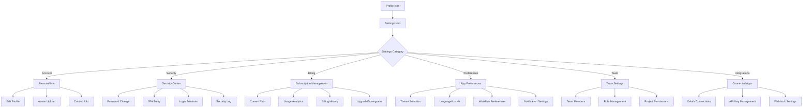

**Advanced Features:**
- **Theme customization** with brand colors
- **Workspace layouts** (dashboard arrangements)
- **Keyboard shortcuts** customization
- **Export preferences** (file formats, naming)
- **AI model preferences** for different tools
- **Collaboration visibility** controls

### 3. Global Search & Command Palette

#### Intelligent Search System
```typescript
interface GlobalSearch {
  searchScopes: {
    tools: ToolSearchResult[];
    projects: ProjectSearchResult[];
    templates: TemplateSearchResult[];
    documentation: DocSearchResult[];
    team: TeamSearchResult[];
    integrations: IntegrationSearchResult[];
  };
  
  commandPalette: {
    quickActions: QuickAction[];
    recentActions: RecentAction[];
    contextualCommands: ContextCommand[];
    customCommands: CustomCommand[];
  };
  
  aiAssistance: {
    intentRecognition: SearchIntent;
    smartSuggestions: Suggestion[];
    naturalLanguageQueries: NLQuery[];
  };
}
```

#### Search & Command Flow
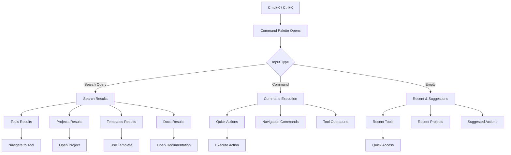

**Smart Features:**
- **Fuzzy search** with typo tolerance
- **Context-aware results** based on current page
- **Natural language processing** for complex queries
- **Learning from usage patterns**
- **Keyboard navigation** with vim-like shortcuts
- **Recent items** and **frequently used** prioritization

#### Command Categories
1. **Navigation Commands**
   - `go to dashboard`, `open tools`, `view projects`
   - `switch to [project name]`, `find [tool name]`

2. **Quick Actions**
   - `create new project`, `generate code`, `deploy project`
   - `export data`, `invite team member`, `upgrade plan`

3. **Tool Operations**
   - `run code generator`, `optimize images`, `analyze performance`
   - `setup CI/CD`, `create component library`

4. **Content Operations**
   - `search documentation`, `find template`, `view tutorials`
   - `check usage stats`, `download reports`

### 4. Plugin Manager & Integration Hub

#### Plugin Ecosystem Architecture
```typescript
interface PluginManager {
  pluginMarketplace: {
    featuredPlugins: Plugin[];
    categoryBrowsing: PluginCategory[];
    searchAndFilter: PluginFilter[];
    userReviews: PluginReview[];
  };
  
  installedPlugins: {
    activePlugins: InstalledPlugin[];
    pluginSettings: PluginConfig[];
    updateManagement: PluginUpdate[];
    troubleshooting: PluginDiagnostic[];
  };
  
  integrationHub: {
    thirdPartyServices: Integration[];
    apiConnections: APIConnection[];
    webhookManagement: Webhook[];
    dataSync: SyncConfiguration[];
  };
  
  developmentTools: {
    pluginSDK: DeveloperTools;
    testingEnvironment: PluginTesting;
    distributionTools: PluginPublishing;
  };
}
```

#### Plugin Management Flow
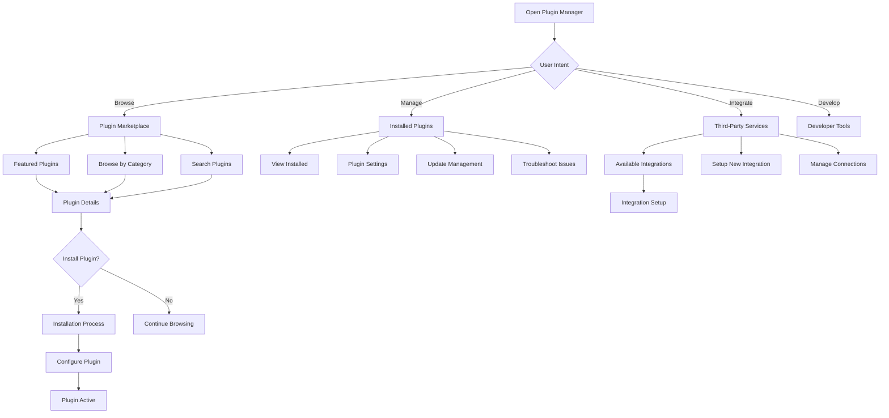

**Plugin Categories:**
1. **Development Tools**
   - Code formatters, linters, test runners
   - Framework-specific enhancements
   - Database connectors

2. **Design & Creative**
   - Image processors, color palette generators
   - Font managers, asset optimizers
   - Design system enhancers

3. **Productivity**
   - Project templates, workflow automators
   - Time trackers, task managers
   - Documentation generators

4. **Analytics & Monitoring**
   - Performance trackers, error reporters
   - Usage analytics, A/B test tools
   - SEO analyzers

5. **Deployment & DevOps**
   - Cloud provider connectors
   - Container orchestrators
   - Monitoring dashboards

### 5. Data Import/Export Hub

#### Comprehensive Data Management
```typescript
interface DataHub {
  importSources: {
    fileFormats: FileImport[];
    cloudServices: CloudImport[];
    databases: DatabaseImport[];
    apiConnections: APIImport[];
  };
  
  exportTargets: {
    fileExports: FileExport[];
    cloudBackups: CloudExport[];
    integrationSync: IntegrationExport[];
    archiveOptions: ArchiveExport[];
  };
  
  dataProcessing: {
    transformation: DataTransform[];
    validation: DataValidation[];
    migration: DataMigration[];
    synchronization: DataSync[];
  };
  
  backupRecovery: {
    automaticBackups: BackupSchedule[];
    manualBackups: ManualBackup[];
    recoveryOptions: RecoveryPlan[];
    versionControl: DataVersioning[];
  };
}
```

#### Data Flow Management
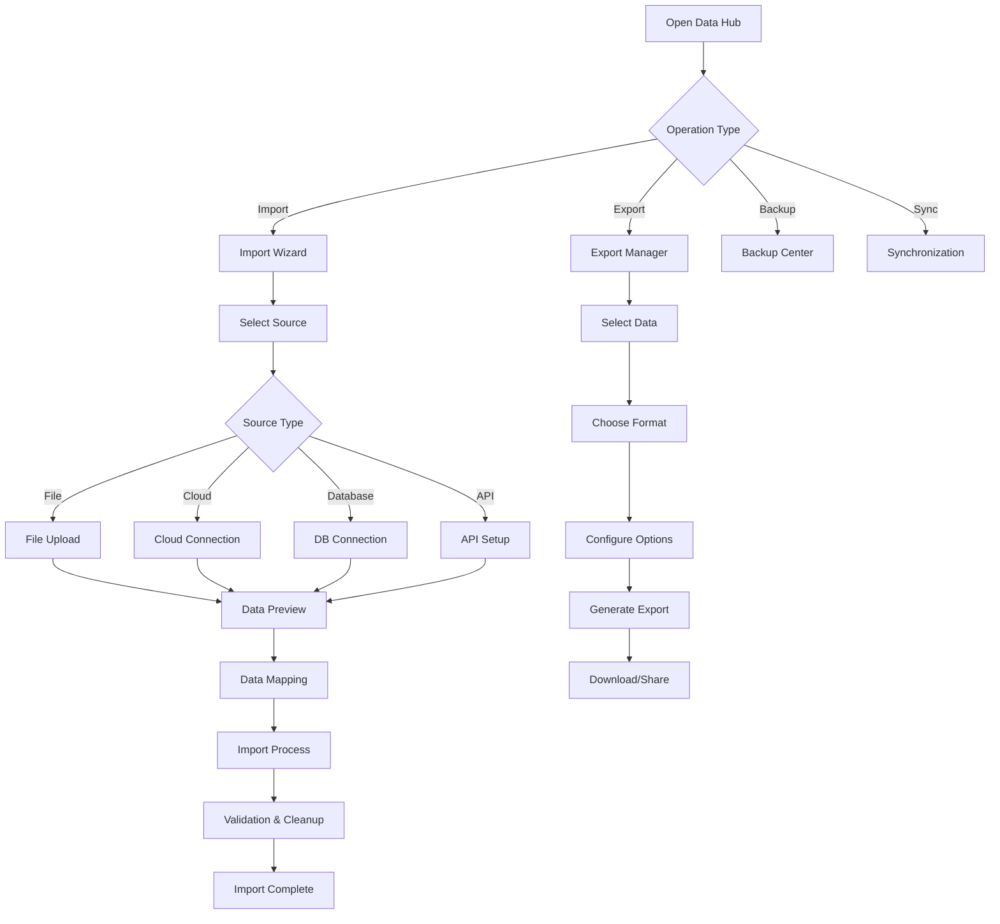

**Import Sources:**
1. **File Formats**
   - JSON, CSV, XML, YAML
   - Figma files, Sketch files
   - Code repositories (ZIP, Git)
   - Database dumps (SQL, NoSQL)

2. **Cloud Services**
   - Google Drive, Dropbox, OneDrive
   - AWS S3, Azure Blob, GCS
   - GitHub, GitLab, Bitbucket
   - Notion, Airtable, Google Sheets

3. **Direct Integrations**
   - CRM systems (Salesforce, HubSpot)
   - Analytics platforms (GA, Mixpanel)
   - E-commerce platforms (Shopify, WooCommerce)
   - Design tools (Figma API, Adobe Creative Suite)

**Export Formats:**
1. **Standard Formats**
   - Project archives (ZIP with full structure)
   - Code exports (GitHub repo, ZIP download)
   - Data dumps (JSON, CSV, SQL)
   - Documentation (PDF, Markdown, HTML)

2. **Platform-Specific**
   - Docker containers
   - Deployment packages (Vercel, Netlify, AWS)
   - CI/CD configurations
   - Environment configurations

### 6. Analytics & Insights Dashboard

#### Comprehensive Analytics Platform
```typescript
interface AnalyticsDashboard {
  userAnalytics: {
    usagePatterns: UsageMetrics[];
    toolPerformance: ToolAnalytics[];
    productivityInsights: ProductivityMetrics[];
    learningProgress: LearningAnalytics[];
  };
  
  projectAnalytics: {
    projectHealth: ProjectMetrics[];
    performanceTracking: PerformanceAnalytics[];
    deploymentInsights: DeploymentMetrics[];
    collaborationStats: CollaborationAnalytics[];
  };
  
  businessIntelligence: {
    revenueAnalytics: RevenueMetrics[];
    userGrowth: GrowthAnalytics[];
    featureAdoption: FeatureMetrics[];
    churnAnalysis: ChurnAnalytics[];
  };
  
  customReporting: {
    dashboardBuilder: CustomDashboard[];
    reportScheduling: ScheduledReport[];
    dataExports: ReportExport[];
    alerting: AlertConfiguration[];
  };
}
```

#### Analytics Navigation Flow
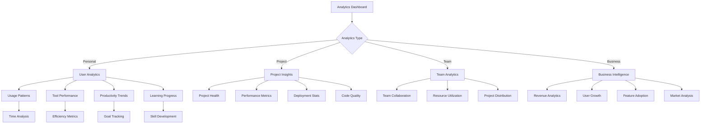

**Key Metrics Categories:**

1. **User Productivity**
   - Daily/weekly active usage
   - Tool efficiency ratings
   - Time saved through automation
   - Learning curve progress

2. **Project Performance**
   - Build success rates
   - Deployment frequency
   - Error rates and debugging time
   - Code quality improvements

3. **Collaboration Effectiveness**
   - Team response times
   - Review cycle efficiency
   - Knowledge sharing metrics
   - Cross-functional collaboration

4. **Business Impact**
   - Revenue attribution
   - Customer acquisition cost
   - Feature ROI analysis
   - Competitive positioning

### 7. Cross-App Workspace Dashboard

#### Unified Workspace Management
```typescript
interface WorkspaceDashboard {
  workspaceOverview: {
    activeProjects: Project[];
    teamActivities: TeamActivity[];
    systemHealth: SystemStatus[];
    quickActions: QuickAction[];
  };
  
  crossAppIntegration: {
    connectedApps: ConnectedApp[];
    dataFlows: DataFlow[];
    workflowAutomation: Workflow[];
    syncStatus: SyncStatus[];
  };
  
  collaborativeFeatures: {
    sharedResources: SharedResource[];
    teamWorkspaces: TeamWorkspace[];
    communicationTools: CommunicationTool[];
    decisionTracking: DecisionLog[];
  };
  
  workspaceCustomization: {
    layoutConfiguration: LayoutConfig[];
    widgetManagement: Widget[];
    themeSettings: ThemeConfig[];
    accessControls: AccessControl[];
  };
}
```

#### Workspace Flow
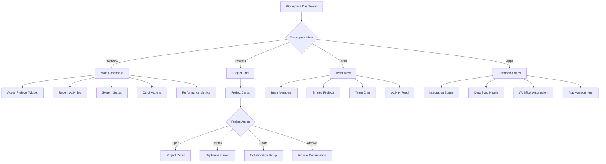

---

## AI Tools User Flows

### AI Tools Hub Overview

#### Tool Discovery & Selection
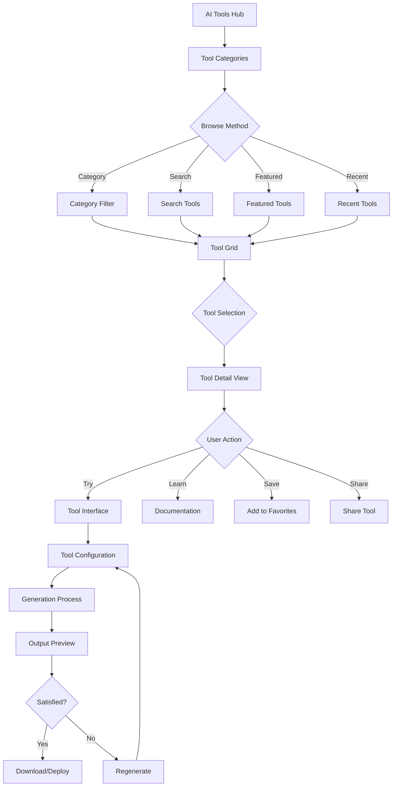

### Core AI Tool Categories

#### 1. Generation Tools Flow

**Code Generator Tool**
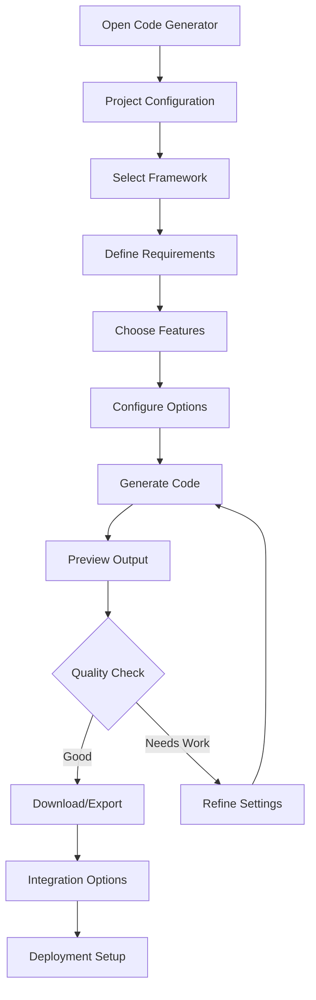

**Full-Stack App Builder**
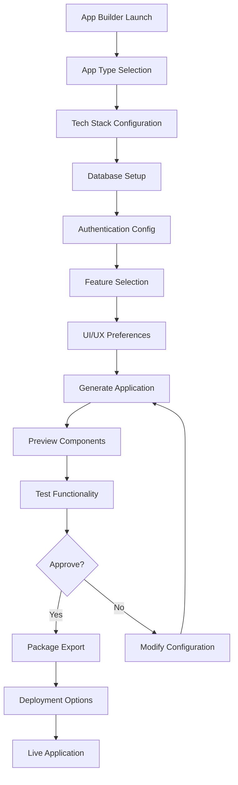

#### 2. Design Tools Flow

**AI Logo Generator**
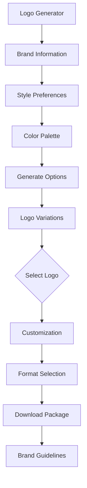

**AI Image Generator**
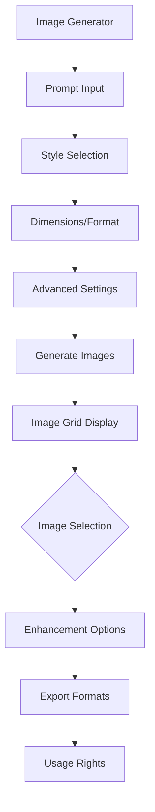

#### 3. Content Creation Flow

**AI Content Generator**
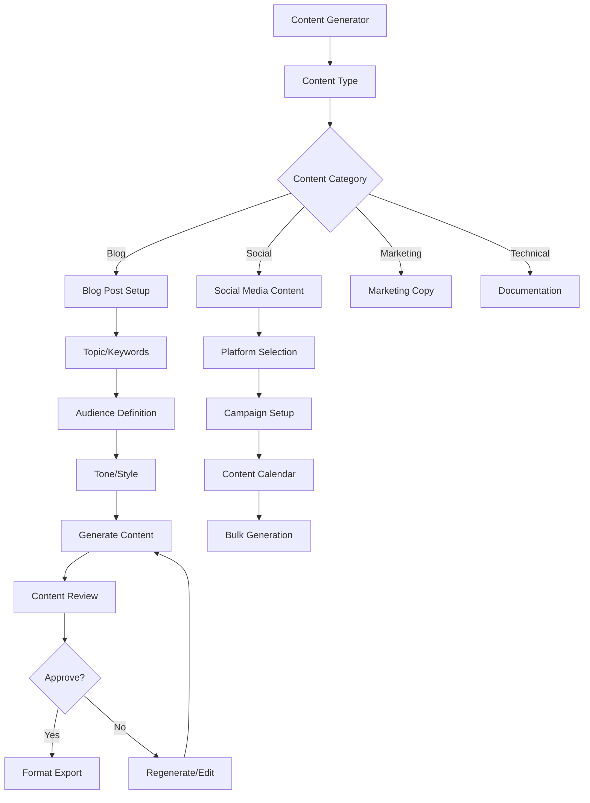

### Tool Integration Workflows

#### Multi-Tool Collaboration
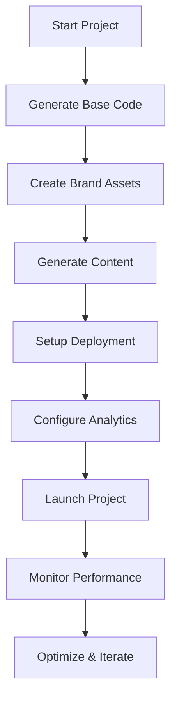

**Cross-Tool Data Flow:**
1. **Code Generator** → produces base application structure
2. **Logo Generator** → creates brand assets for application
3. **Content Generator** → produces marketing copy and documentation
4. **Deployment Tools** → handles CI/CD and hosting setup
5. **Analytics Tools** → monitors performance and user behavior

---

## Creator Economy Flows

### Content Creation Pipeline

#### Multi-Platform Content Strategy
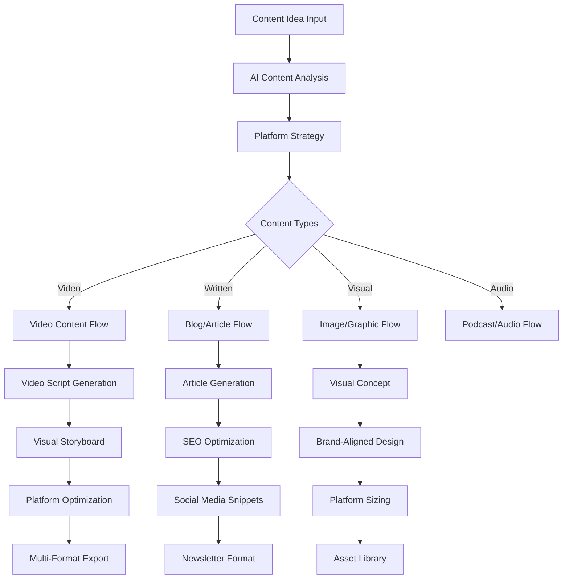

#### Content Repurposing Engine
```typescript
interface ContentPipeline {
  inputContent: {
    originalContent: ContentAsset;
    contentType: 'video' | 'article' | 'podcast' | 'image';
    sourceMetadata: ContentMetadata;
  };
  
  repurposingEngine: {
    platformAdaptation: PlatformConfig[];
    formatTransformation: FormatConverter[];
    audienceTargeting: AudienceProfile[];
    brandConsistency: BrandGuidelines;
  };
  
  outputGeneration: {
    socialMediaPosts: SocialPost[];
    blogArticles: BlogPost[];
    emailCampaigns: EmailContent[];
    videoClips: VideoSegment[];
    infographics: Infographic[];
    podcastEpisodes: PodcastContent[];
  };
  
  distributionAutomation: {
    schedulingCalendar: ContentCalendar;
    platformPublishing: PublishingQueue[];
    performanceTracking: AnalyticsIntegration[];
  };
}
```

### Print-on-Demand Integration

#### Product Creation & Management Flow
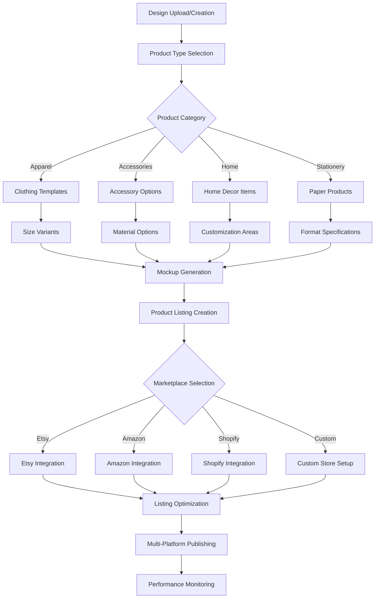

#### Revenue Analytics & Optimization
```mermand
graph TD
A[Sales Data Collection] --> B[Revenue Analytics]
B --> C{Analysis Type}
C -->|Product| D[Product Performance]
C -->|Platform| E[Platform Comparison]
C -->|Trend| F[Market Trends]
C -->|Customer| G[Customer Analytics]

D --> H[Best Sellers Analysis]
E --> I[Platform ROI]
F --> J[Seasonal Patterns]
G --> K[Customer Segments]

H --> L[Inventory Optimization]
I --> M[Platform Strategy]
J --> N[Content Planning]
K --> O[Targeting Refinement]

L --> P[Automated Reordering]
M --> Q[Resource Allocation]
N --> R[Campaign Scheduling]
O --> S[Personalization]
```

---

## Advanced Features Flows

### Multi-Agent Orchestration System

#### Agent Workflow Management
```typescript
interface AgentOrchestration {
  agentEcosystem: {
    codeGenerationAgent: CodeAgent;
    designAgent: DesignAgent;
    contentAgent: ContentAgent;
    deploymentAgent: DeploymentAgent;
    qualityAssuranceAgent: QAAgent;
    optimizationAgent: OptimizationAgent;
  };
  
  workflowOrchestration: {
    taskDistribution: TaskAllocation[];
    agentCoordination: CoordinationProtocol[];
    resourceManagement: ResourceAllocation[];
    qualityControl: QualityGates[];
  };
  
  intelligentAutomation: {
    adaptiveLearning: LearningAlgorithm[];
    contextAwareness: ContextEngine[];
    decisionMaking: DecisionTree[];
    errorRecovery: RecoveryProtocol[];
  };
}
```

#### Complex Project Workflow
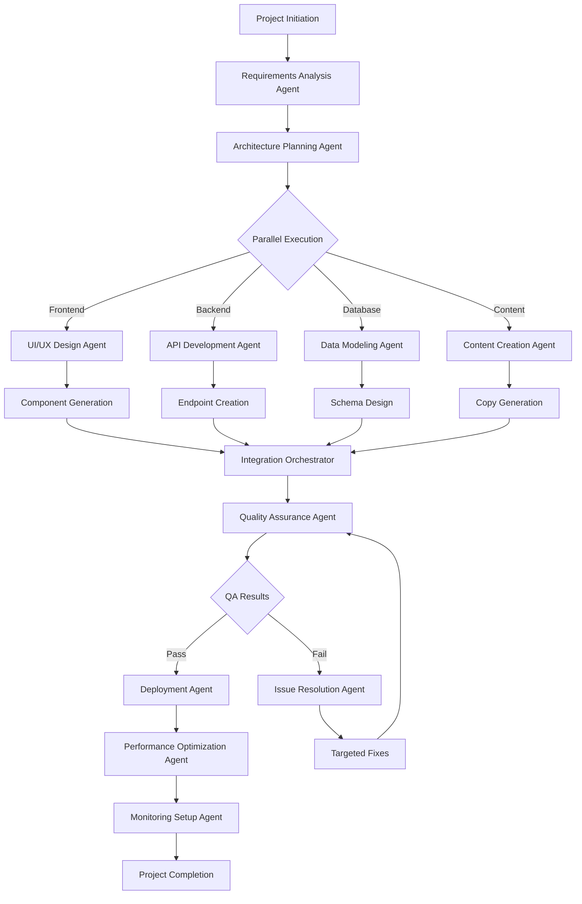

### Real-Time Collaboration

#### Collaborative Development Environment
```mermaid
graph TD
A[Team Member Joins] --> B[Workspace Access]
B --> C[Real-Time Sync Setup]
C --> D{Collaboration Mode}
D -->|Live Edit| E[Shared Editor]
D -->|Review| F[Review Mode]
D -->|Observe| G[View-Only Access]

E --> H[Conflict Resolution]
H --> I[Merge Strategy]
I --> J[Auto-Save & Sync]

F --> K[Comment System]
K --> L[Approval Workflow]
L --> M[Change Integration]

G --> N[Activity Feed]
N --> O[Notification System]

J --> P[Version Control]
M --> P
O --> P
P --> Q[Team Dashboard Update]
```

#### Team Communication Flow
```mermaid
graph TD
A[Communication Trigger] --> B{Communication Type}
B -->|Chat| C[In-App Messaging]
B -->|Video| D[Video Conference]
B -->|Review| E[Code Review]
B -->|Notification| F[Alert System]

C --> G[Context-Aware Chat]
G --> H[File Sharing]
H --> I[Decision Logging]

D --> J[Screen Sharing]
J --> K[Recording Options]
K --> L[Meeting Notes]

E --> M[Inline Comments]
M --> N[Suggestion Mode]
N --> O[Approval Process]

F --> P[Smart Notifications]
P --> Q[Digest Summaries]
```

---

## Integration & Deployment Flows

### Deployment Management System

#### Multi-Platform Deployment Pipeline
```mermaid
graph TD
A[Deploy Request] --> B[Platform Selection]
B --> C{Platform Type}
C -->|Vercel| D[Vercel Deployment]
C -->|Netlify| E[Netlify Deployment]
C -->|AWS| F[AWS Deployment]
C -->|Heroku| G[Heroku Deployment]
C -->|Custom| H[Custom Server]

D --> I[Build Configuration]
E --> I
F --> J[Infrastructure Setup]
G --> I
H --> K[Server Preparation]

I --> L[Build Process]
J --> M[Resource Provisioning]
K --> N[Environment Setup]

L --> O[Deployment Execution]
M --> O
N --> O

O --> P[Health Checks]
P --> Q{Deployment Status}
Q -->|Success| R[Live Application]
Q -->|Failure| S[Rollback Process]
S --> T[Error Analysis]
T --> U[Fix & Retry]
```

#### CI/CD Pipeline Configuration
```typescript
interface CICDPipeline {
  sourceControl: {
    gitIntegration: GitProvider[];
    branchStrategy: BranchingModel;
    webhookConfiguration: WebhookConfig[];
  };
  
  buildPipeline: {
    buildSteps: BuildStep[];
    testSuites: TestSuite[];
    qualityGates: QualityGate[];
    artifactGeneration: ArtifactConfig[];
  };
  
  deploymentStages: {
    environments: Environment[];
    approvalProcess: ApprovalWorkflow[];
    rolloutStrategy: DeploymentStrategy;
    monitoringSetup: MonitoringConfig[];
  };
  
  rollbackMechanisms: {
    automaticRollback: RollbackTrigger[];
    manualRollback: RollbackProcess[];
    versionManagement: VersionControl[];
  };
}
```

### Third-Party Integrations

#### Integration Marketplace
```mermaid
graph TD
A[Integration Hub] --> B[Browse Integrations]
B --> C{Integration Category}
C -->|Development| D[Dev Tools]
C -->|Design| E[Design Tools]
C -->|Analytics| F[Analytics Tools]
C -->|Communication| G[Communication Tools]
C -->|Storage| H[Storage Services]

D --> I[GitHub Integration]
D --> J[VS Code Extension]
D --> K[Docker Registry]

E --> L[Figma Connect]
E --> M[Adobe Creative Suite]
E --> N[Canva Integration]

F --> O[Google Analytics]
F --> P[Mixpanel Connect]
F --> Q[Hotjar Integration]

G --> R[Slack Integration]
G --> S[Discord Connect]
G --> T[Microsoft Teams]

H --> U[AWS S3]
H --> V[Google Drive]
H --> W[Dropbox Sync]
```

#### Integration Setup Flow
```mermaid
graph TD
A[Select Integration] --> B[Integration Details]
B --> C[Permission Requirements]
C --> D[Authentication Setup]
D --> E{Auth Method}
E -->|OAuth| F[OAuth Flow]
E -->|API Key| G[API Key Input]
E -->|Custom| H[Custom Setup]

F --> I[Service Authorization]
G --> J[Key Validation]
H --> K[Custom Configuration]

I --> L[Connection Test]
J --> L
K --> L

L --> M{Connection Status}
M -->|Success| N[Integration Active]
M -->|Failed| O[Troubleshooting]
O --> P[Error Resolution]
P --> L

N --> Q[Configuration Options]
Q --> R[Sync Settings]
R --> S[Integration Complete]
```

---

## Mobile Experience Flows

### Responsive Design Patterns

#### Mobile-First Navigation
```mermaid
graph TD
A[Mobile App Launch] --> B[Touch-Optimized UI]
B --> C{Navigation Method}
C -->|Bottom Nav| D[Bottom Tab Bar]
C -->|Sidebar| E[Collapsible Sidebar]
C -->|Gesture| F[Swipe Navigation]

D --> G[Quick Actions]
E --> H[Full Menu Access]
F --> I[Gesture Controls]

G --> J[Tool Shortcuts]
H --> K[Advanced Features]
I --> L[Intuitive Navigation]

J --> M[Mobile-Optimized Tools]
K --> N[Desktop Parity]
L --> O[Accessibility Features]
```

#### Mobile Tool Adaptation
```typescript
interface MobileExperience {
  touchOptimization: {
    touchTargets: TouchTarget[];
    gestureRecognition: GestureHandler[];
    hapticFeedback: HapticResponse[];
    swipeActions: SwipeAction[];
  };
  
  mobileLayouts: {
    adaptiveDesign: ResponsiveLayout[];
    collapsibleSections: CollapsibleUI[];
    modalOptimization: MobileModal[];
    tabletMode: TabletLayout[];
  };
  
  offlineCapabilities: {
    dataCache: OfflineCache[];
    syncQueue: SyncQueue[];
    offlineMode: OfflineFeatures[];
    progressiveSync: SyncStrategy[];
  };
  
  performanceOptimization: {
    lazyLoading: LazyLoadStrategy[];
    bundleOptimization: MobileBundling[];
    imageOptimization: MobileImages[];
    batteryOptimization: PowerManagement[];
  };
}
```

---

## Error Handling & Recovery

### Comprehensive Error Management

#### Error Classification System
```typescript
interface ErrorManagement {
  errorCategories: {
    userErrors: UserError[];
    systemErrors: SystemError[];
    networkErrors: NetworkError[];
    integrationErrors: IntegrationError[];
    validationErrors: ValidationError[];
  };
  
  recoveryStrategies: {
    automaticRecovery: AutoRecoveryStrategy[];
    userGuidedRecovery: GuidedRecovery[];
    manualIntervention: ManualRecovery[];
    escalationProtocol: EscalationPath[];
  };
  
  userExperience: {
    errorPrevention: PreventionStrategy[];
    gracefulDegradation: DegradationStrategy[];
    progressPreservation: ProgressSaving[];
    userCommunication: ErrorCommunication[];
  };
}
```

#### Error Resolution Flow
```mermaid
graph TD
A[Error Detected] --> B[Error Classification]
B --> C{Error Severity}
C -->|Critical| D[Immediate Escalation]
C -->|High| E[Automated Recovery]
C -->|Medium| F[User Notification]
C -->|Low| G[Background Handling]

D --> H[System Alert]
E --> I[Recovery Attempt]
F --> J[Error Dialog]
G --> K[Silent Resolution]

I --> L{Recovery Success?}
L -->|Yes| M[Normal Operation]
L -->|No| N[User Intervention]

J --> O[User Action Required]
O --> P{User Response}
P -->|Retry| Q[Retry Operation]
P -->|Cancel| R[Graceful Exit]
P -->|Help| S[Support System]

N --> T[Escalation Path]
S --> U[Guided Resolution]
```

### Resilience Patterns

#### Network Resilience
```mermaid
graph TD
A[Network Operation] --> B[Connection Check]
B --> C{Network Status}
C -->|Online| D[Direct Request]
C -->|Offline| E[Offline Queue]
C -->|Slow| F[Optimized Request]

D --> G{Request Success?}
G -->|Yes| H[Normal Flow]
G -->|No| I[Retry Logic]

E --> J[Queue Management]
J --> K[Sync When Available]

F --> L[Compressed Data]
L --> M[Progressive Loading]

I --> N[Exponential Backoff]
N --> O{Max Retries?}
O -->|No| P[Retry Request]
O -->|Yes| Q[Fallback Strategy]
```

---

## Analytics & Monitoring

### Real-Time Performance Monitoring

#### System Health Dashboard
```typescript
interface MonitoringSystem {
  performanceMetrics: {
    responseTime: ResponseTimeMetrics[];
    throughput: ThroughputMetrics[];
    errorRates: ErrorRateMetrics[];
    resourceUtilization: ResourceMetrics[];
  };
  
  userExperienceMetrics: {
    pageLoadTimes: LoadTimeMetrics[];
    interactionLatency: InteractionMetrics[];
    conversionFunnels: ConversionMetrics[];
    userSatisfaction: SatisfactionMetrics[];
  };
  
  businessMetrics: {
    toolUsage: ToolUsageMetrics[];
    featureAdoption: FeatureMetrics[];
    revenueImpact: RevenueMetrics[];
    userRetention: RetentionMetrics[];
  };
  
  alertingSystem: {
    thresholdAlerts: AlertThreshold[];
    anomalyDetection: AnomalyAlert[];
    predictiveAlerts: PredictiveAlert[];
    escalationRules: EscalationRule[];
  };
}
```

#### Monitoring Flow
```mermaid
graph TD
A[System Activity] --> B[Data Collection]
B --> C[Real-Time Processing]
C --> D{Threshold Check}
D -->|Normal| E[Metrics Storage]
D -->|Warning| F[Alert Generation]
D -->|Critical| G[Immediate Notification]

E --> H[Dashboard Update]
F --> I[Team Notification]
G --> J[Emergency Response]

H --> K[Trend Analysis]
I --> L[Investigation Start]
J --> M[Incident Management]

K --> N[Predictive Insights]
L --> O[Root Cause Analysis]
M --> P[Recovery Actions]

N --> Q[Optimization Recommendations]
O --> R[Prevention Measures]
P --> S[Post-Incident Review]
```

---

## User Success Metrics

### Key Performance Indicators

#### User Engagement Metrics
1. **Activation Metrics**
   - Time to first value (< 5 minutes)
   - Tool completion rate (> 80%)
   - Onboarding completion (> 70%)

2. **Retention Metrics**
   - Daily active users
   - Weekly retention rate (> 40%)
   - Monthly churn rate (< 10%)

3. **Value Realization**
   - Projects completed per user
   - Tools used per session
   - Output download rate

4. **Satisfaction Metrics**
   - Net Promoter Score (> 50)
   - User satisfaction rating (> 4.5/5)
   - Support ticket volume (trend down)

#### Business Impact Metrics
1. **Revenue Metrics**
   - Monthly recurring revenue growth
   - Average revenue per user
   - Conversion rate from free to paid

2. **Efficiency Metrics**
   - Development time reduction
   - Cost savings per project
   - Automation adoption rate

3. **Innovation Metrics**
   - New feature adoption rate
   - User-generated content quality
   - Community contribution growth

---

## Conclusion

This comprehensive user flow documentation provides a complete blueprint for the FlashFusion platform, ensuring:

1. **Seamless User Experience** - Every interaction is designed for maximum efficiency and satisfaction
2. **Scalable Architecture** - Systems can grow with user demand and feature expansion
3. **Robust Error Handling** - Users never feel lost or frustrated
4. **Data-Driven Optimization** - Continuous improvement based on usage analytics
5. **Comprehensive Feature Coverage** - All aspects of the development lifecycle are supported

The platform serves as a complete AI-powered development ecosystem that transforms how users create, deploy, and manage web applications across the entire development lifecycle.